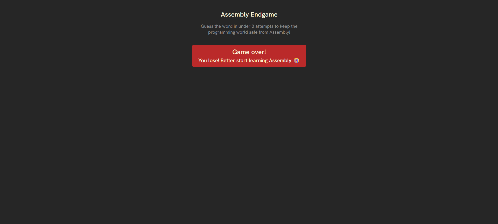
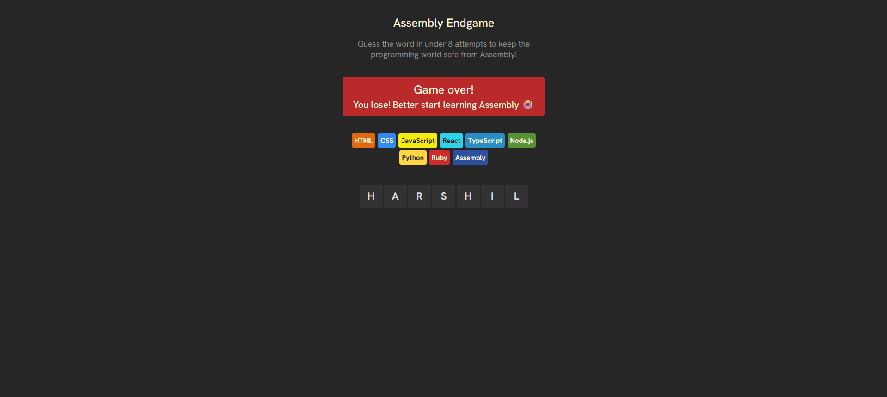
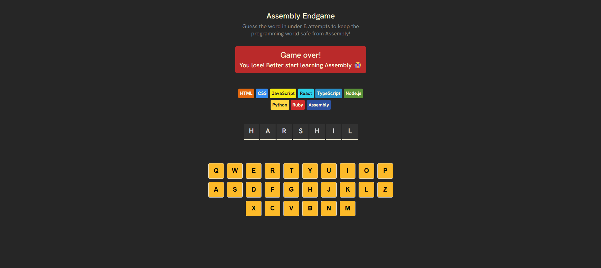
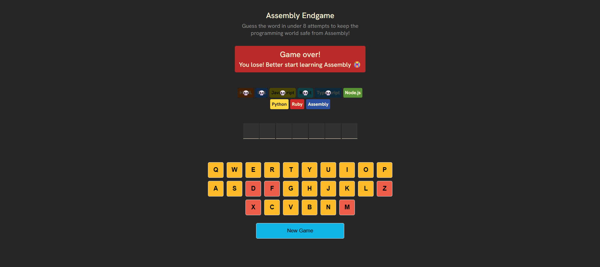
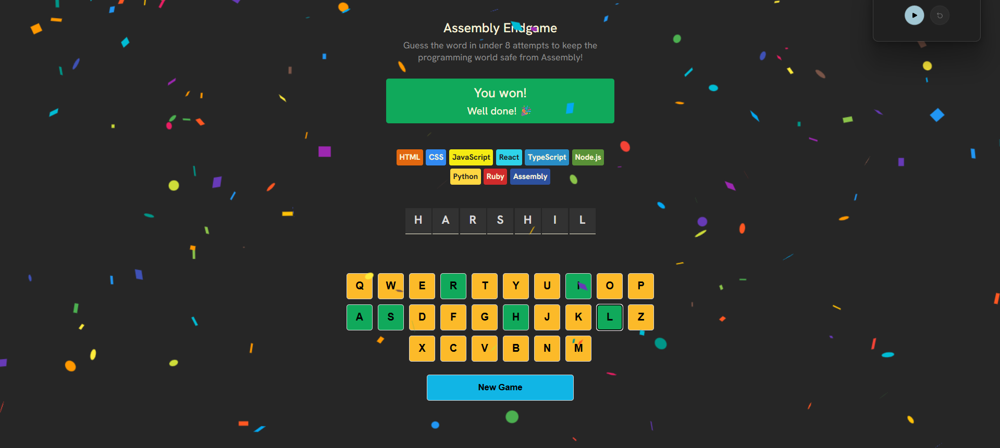
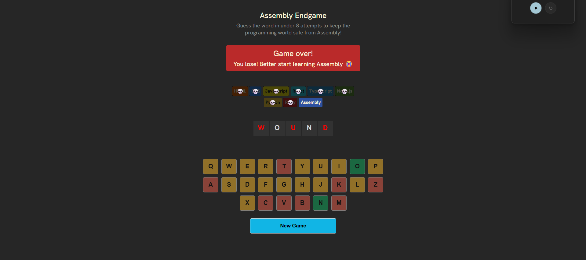

# 🧩 Assembly Endgame (screenshots below)

A programming-themed **Hangman-style game** where each wrong guess kills a programming language, and if you lose, you’re left with only **Assembly**.

Live Link: https://assembly-endgame-by-harshil.vercel.app/

**NOTE:** Every line of logic and UI in this project was written manually. No AI code generation, no Copilot, the goal was to deeply understand **state-driven UI**, derived state, and conditional rendering in React.


## 🎯 Overview

Assembly Endgame is a twist on Hangman with a developer-centric theme.

Game flow:
1. A random word is selected
2. You guess letters using an on-screen keyboard
3. Each wrong guess eliminates a programming language
4. If too many languages die, you lose, and are forced to “learn Assembly”
5. Win the game to save the programming world

The game is designed to aggressively reinforce **derived state**, **pure rendering**, and **UI as a function of state**.


## ✨ Features

- **Random word generation** from a predefined word list
- **On-screen keyboard** with disabled, correct, and wrong states
- **Derived win & loss logic** using `.every()` and array filtering
- **Progressive language elimination** on wrong guesses
- **Dynamic farewell messages** for each eliminated language
- **Missing-letter reveal** on game loss
- **Confetti animation** on win
- **Game-over lock** (keyboard disabled once game ends)
- **Restart game logic** without page reload
- **Clean conditional UI states** (win, lose, warning, in-progress)


## 🧠 What I Practiced / Learned

### React State & Derived State
- Managing multiple state values (`currentWord`, `guessedLetters`)
- Lazy initialization with `useState(() => getRandomWord())`
- Deriving complex values instead of storing redundant state:
  - wrong guess count
  - win condition
  - loss condition
  - game-over state
- Avoiding unnecessary re-renders by computing values inline

### Conditional Rendering
- Rendering UI based on game state (win / lose / warning)
- Showing contextual farewell messages for wrong guesses
- Revealing missed letters only on game loss
- Disabling keyboard interactions after game ends

### Component & UI Logic
- Mapping arrays → UI elements (languages, letters, keyboard)
- Preventing duplicate guesses safely
- Styling components based on dynamic state
- Clean separation of static vs derived values

### JavaScript Fundamentals
- Array methods: `.map()`, `.filter()`, `.every()`
- Random selection logic
- Guard clauses to prevent invalid state updates
- Immutable state updates
- Defensive UI logic

This project pushed me to think **declaratively** instead of imperatively.


## 🧱 Tech Stack

- **React** (useState, derived state, conditional rendering)
- **Vite**
- **JavaScript (ES6+)**
- **clsx** for conditional class management
- **react-confetti** for win animations
- **CSS** for layout and state-based styling


## 🖼️ Screenshots

### Basic layout ready  


### Language chips added  


### Word container rendered  


### On-screen keyboard  


### Language removed on wrong guess  


### Confetti on win  


### Missing letters highlighted on loss  



## 📁 File Structure

```text
src/
 ├─ assets/
 ├─ App.jsx
 ├─ App.css
 ├─ index.css
 ├─ main.jsx
 ├─ languages.js
 └─ words.js
public/
 ├─ 1_basicLayout.png
 ├─ 2_languageChipsAdded.png
 ├─ 3_wordContainer.png
 ├─ 4_keyboard.png
 ├─ 5_skullAddedForWrongGuess.png
 ├─ 6_confettiAdded.png
 └─ 7_missingLetterHighlight.png
.gitignore
index.html
package.json
vite.config.js
README.md
```

## Running the Project Locally

Install dependencies:

```
npm install
```

Start development server:
```
npm run dev
```

If you lose… better start learning Assembly AND ⭐ the repo if you enjoyed it.